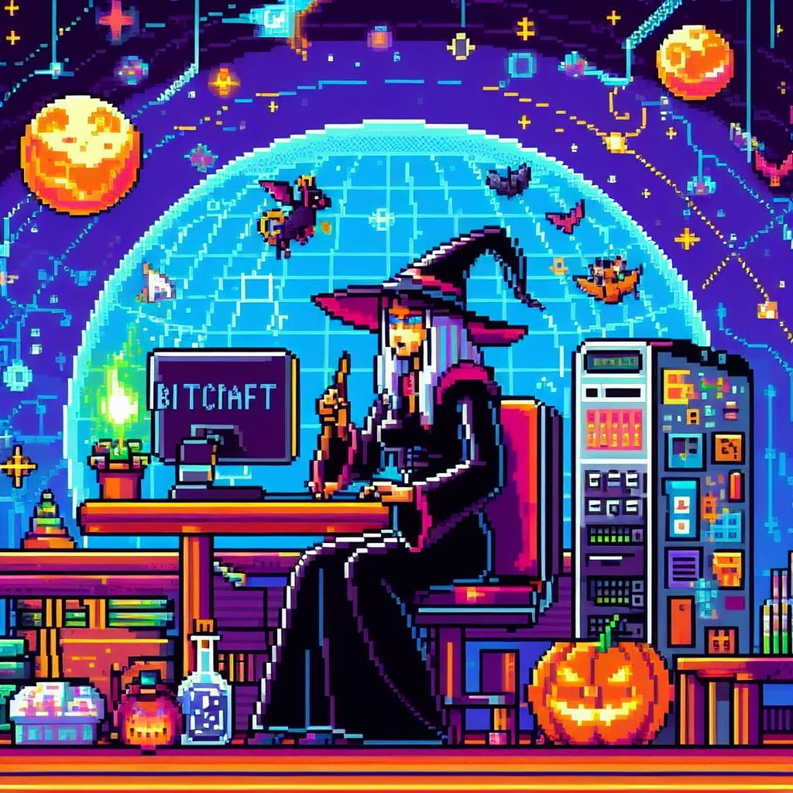
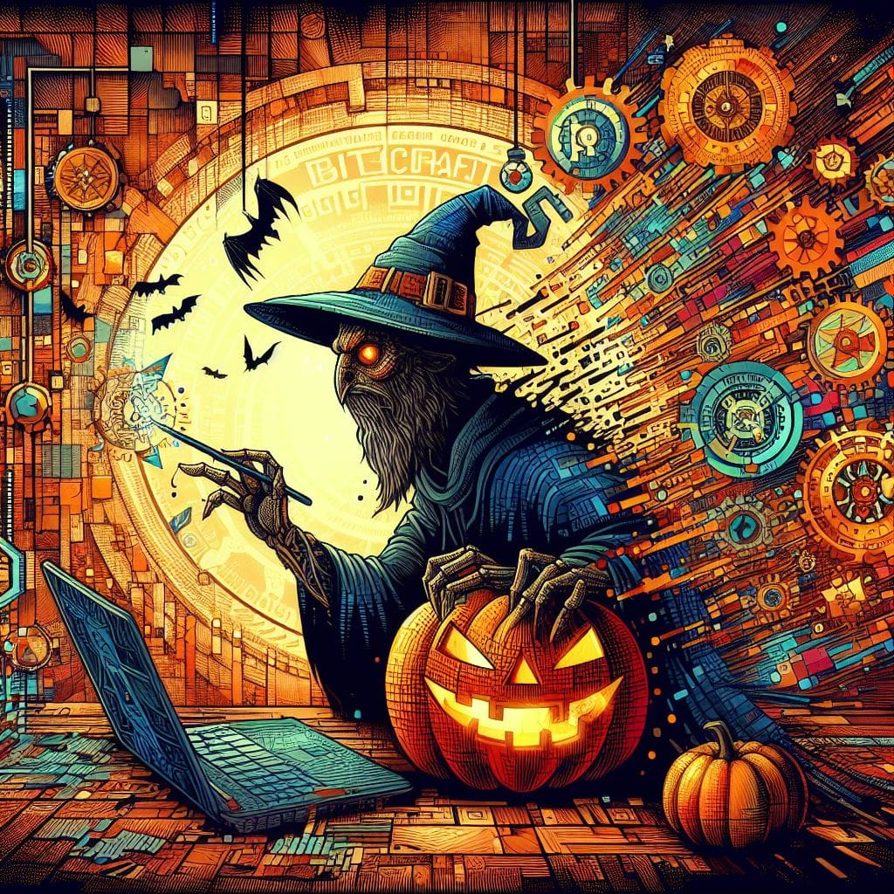
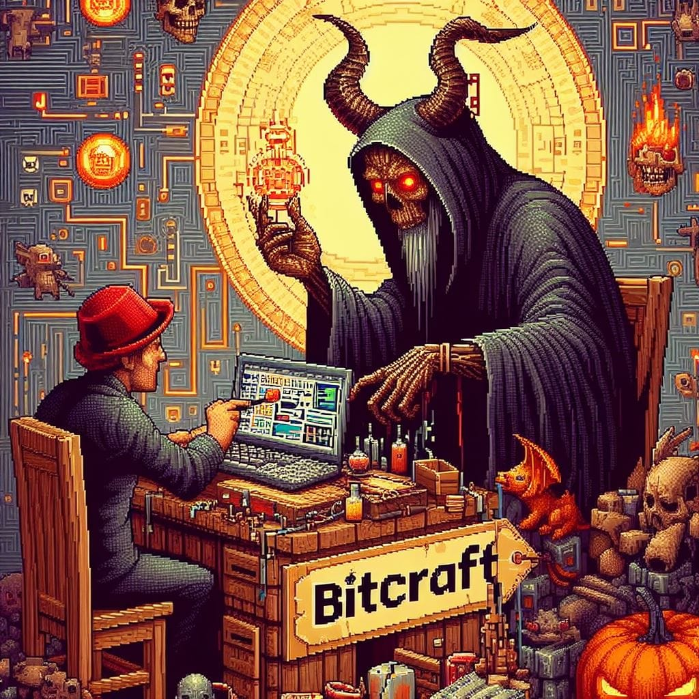
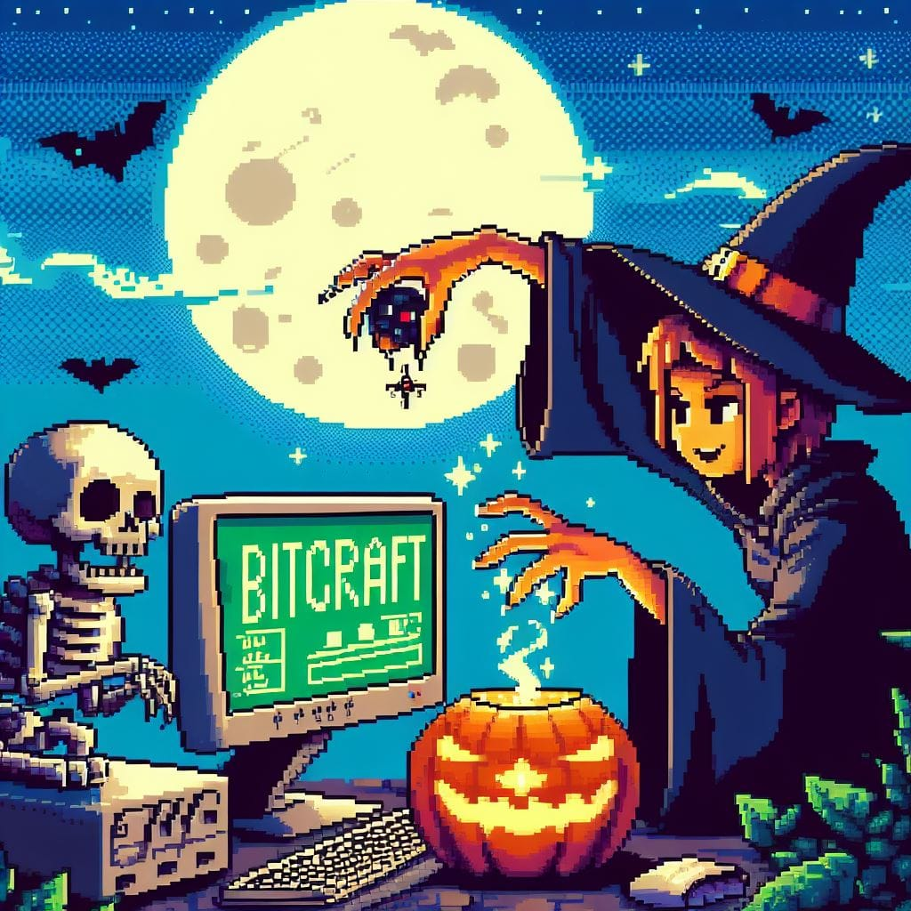

# B1tCraft :hammer_and_wrench:

  
  
  
  

## Descrição :memo:
Organização de desenvolvimento colaborativo entre amigos. Foco em soluções de software utilizando tecnologias front-end e back-end.

## Tecnologias :computer:
- Front-end: HTML5, CSS, JavaScript, React, Angular, Next.js.
- Back-end: Java, PHP, Python, Node.js, Spring Framework, Django, Laravel.

## Projetos :file_folder:
Repositórios para desenvolvimento colaborativo de aplicações web. Acesso restrito a membros.

## Colaboração :busts_in_silhouette:
Aberto a contribuições de membros da organização.

## Contato :mailbox:
Email: gsbadbr@gmail.com
